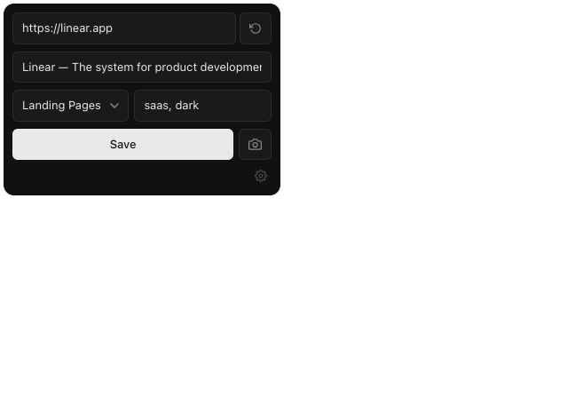
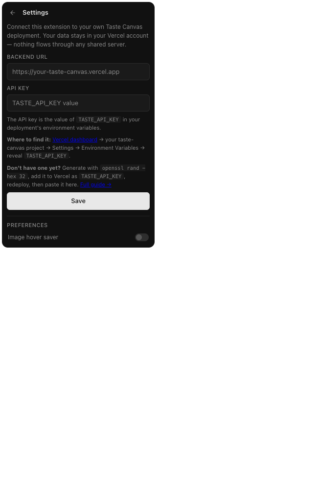

# Taste Canvas — Chrome Extension

One-click save from any webpage to your self-hosted [Taste Canvas](https://github.com/spoony-vu/taste-canvas) board.

**[→ taste-canvas-landing.vercel.app](https://taste-canvas-landing.vercel.app)** — full setup guide, screenshots, FAQ.


## What it does

- **Right-click any image, video, or link** → "Save to Taste Canvas"
- **Right-click anywhere on a page** → "Save page" (captures full-page screenshot)
- **Hover any image** → click the floating "+" button to save it (Pinterest-style)
- **Keyboard shortcut** `Alt+Shift+S` → save current page
- **Popup** → paste a URL, edit title/category/tags, save

Tweet URLs are auto-detected and routed through the backend's `/api/tweet` import (uses fxtwitter for media metadata).

## What it looks like

| Save | Settings |
|------|----------|
|  |  |

## Install

The extension is unpublished — install from source:

1. Clone this repo: `git clone https://github.com/spoony-vu/taste-canvas-extension.git`
2. Open `chrome://extensions` in Chrome (or any Chromium browser)
3. Toggle **Developer mode** on (top-right)
4. Click **Load unpacked** and select the cloned directory
5. Click the extension icon in your toolbar to open the popup
6. First-run will show the **Settings** panel — fill in:
   - **Backend URL** — your deployed Taste Canvas origin (`https://your-taste-canvas.vercel.app`)
   - **API key** — your `TASTE_API_KEY` (see below for how to find or generate it)

The extension verifies the URL + key by hitting `/api/manifest` before saving. Once connected, you're done.

### Where do I get the API key?

`TASTE_API_KEY` is a Vercel environment variable in your Taste Canvas deployment. Three scenarios:

**You set it during the Deploy-to-Vercel flow** (most common):
1. Go to [vercel.com/dashboard](https://vercel.com/dashboard) → your `taste-canvas` project
2. **Settings → Environment Variables**
3. Find `TASTE_API_KEY` → click the eye icon to reveal → copy
4. Paste into the extension's Settings panel → **Save**

**You never set one** (write endpoints are currently open — fix this):
1. Generate one: `openssl rand -hex 32`
2. Vercel → project → Settings → Environment Variables → **Add New** → name `TASTE_API_KEY`, paste value, select all environments → **Save**
3. **Redeploy** (Deployments → latest → ⋯ → Redeploy) so the new var takes effect
4. Paste the same value into the extension

**You want to rotate it:**
1. Generate a new `openssl rand -hex 32` value
2. Update the env var in Vercel → redeploy
3. Update the extension's Settings with the new value

## How it stays yours

The extension talks ONLY to the backend URL you configured. There is no shared server, no telemetry, and no analytics. Your API key lives in `chrome.storage.sync` so it travels with your Chrome profile but never leaves your devices. Each fork of Taste Canvas runs its own copy of this extension pointed at its own backend.

## Permissions explained

| Permission | Why |
|-----------|-----|
| `activeTab` | Read the current tab's URL and title when you click save |
| `contextMenus` | Add right-click menu items |
| `storage` | Persist your settings + last-used category |
| `scripting` | Inject the page-meta extractor that reads `og:image`/`og:title` |
| `<all_urls>` (host) | The hover-to-save image overlay needs to run on every page you visit |
| `optional_host_permissions` | Granted on demand for your specific backend URL when you save Settings |

The extension does NOT request access to your backend up-front — it asks for that permission ONLY when you click **Save** in Settings, and only for the exact origin you typed.

## Develop

There is no build step. Edit any file, then click the **reload** icon on the extension card in `chrome://extensions`.

```
extension/
├── manifest.json          # MV3 manifest
├── background.js          # Service worker — context menus, hotkey, save dispatch
├── content.js             # Hover overlay + toast
├── lib/
│   └── api.js             # Backend client (reads config from chrome.storage.sync)
├── popup/
│   ├── popup.html         # Main + Settings screens
│   ├── popup.js           # Screen routing, settings save, capture flow
│   └── popup.css
├── styles/
│   └── overlay.css        # Hover button + toast styles
└── icons/
    └── icon16.png, icon48.png, icon128.png
```

### Resetting

To wipe stored config (during testing):

```js
// In the extension's service worker DevTools console
chrome.storage.sync.clear()
```

Or right-click the extension icon → **Manage extension** → **Site access** → revoke the backend host permission.

## Publishing to Chrome Web Store

To publish a new version: bump the `version` field in `manifest.json`, run `./scripts/pack.sh`, upload the resulting zip from `dist/` to the Chrome Web Store dashboard, paste in the listing copy from [`store/LISTING.md`](store/LISTING.md), and upload the assets in `store/assets/` (icon, screenshots, promo tiles). The store-facing privacy policy lives at [`store/PRIVACY.md`](store/PRIVACY.md).

```sh
./scripts/pack.sh
# → dist/taste-canvas-extension-vX.Y.Z.zip
```

## License

MIT
